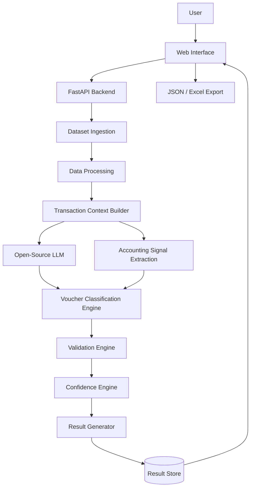
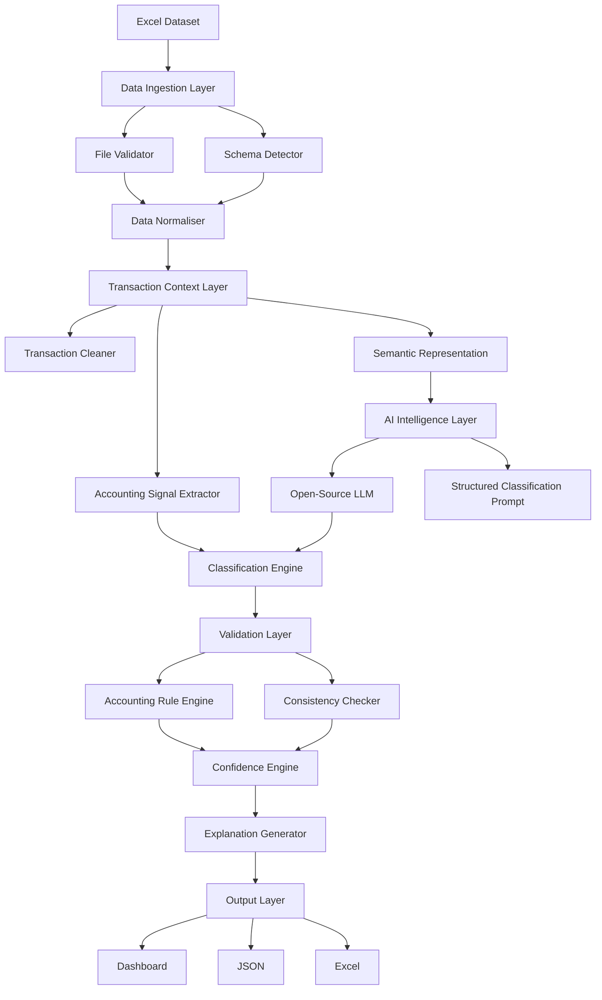
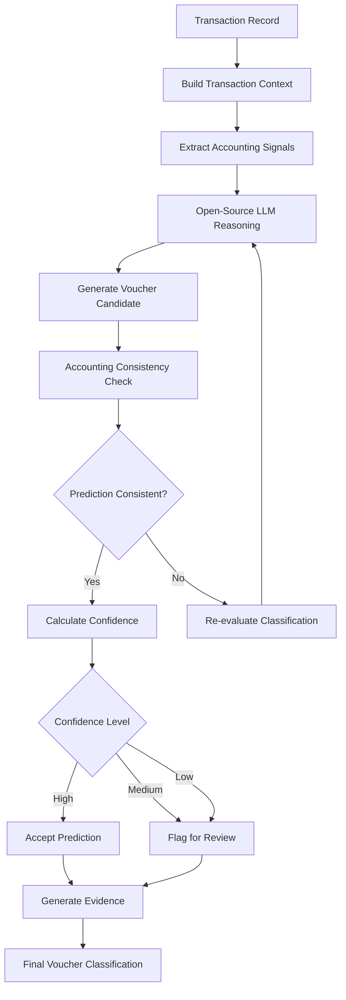

# VYOM+ — Intelligent Voucher Classification

> **From Transaction Data to Accounting Intelligence**

An open-source AI-powered accounting intelligence system that understands structured financial transactions and automatically determines the appropriate accounting voucher category.

---

## 1. Project Name

# VYOM+ Intelligent Voucher Classification

### Tagline

**From Transaction Data to Accounting Intelligence**

VYOM+ is an AI-powered voucher classification system that analyses structured transaction information and predicts the appropriate accounting voucher category using an open-source Large Language Model (LLM), accounting-aware reasoning, validation rules, confidence scoring, and explainable classification.

---

## 2. Problem Statement

Modern accounting systems process large volumes of financial transactions such as purchases, sales, payments, receipts, returns, stock movements, payroll, imports, and exports.

Although the transaction data may already be structured, determining the correct accounting voucher type requires understanding the relationship between multiple fields.

The system must distinguish between semantically similar transaction categories such as:

- Purchase vs Sales
- Purchase Return vs Sales Return
- Payment vs Receipt
- Contra vs Payment / Receipt
- Journal vs conventional transactions
- Material In vs Purchase
- Material Out vs Sales
- Import vs Purchase
- Export vs Sales

A single keyword is often insufficient to determine the correct voucher category.

The challenge is therefore to build an intelligent system that understands the **complete transaction context** and predicts the most appropriate voucher category.

The provided dataset contains structured transaction information while the voucher-type field is intentionally missing.

---

## 3. Project Overview

VYOM+ acts as an intelligent classification layer between structured transaction data and automated accounting workflows.

The system accepts an Excel dataset containing transaction records and analyses available information such as:

- Seller / Supplier
- Buyer / Customer
- Invoice number and date
- Item descriptions
- Quantities
- Taxable value
- GST
- Discounts
- Freight
- Payment information
- Currency
- Import / Export details
- Payroll information
- Debit / Credit information
- Return information
- Order references
- Delivery information
- Other transaction metadata

### Core Process

1. Read the transaction dataset.
2. Detect and validate the input schema.
3. Clean and normalise transaction data.
4. Build a contextual representation of each transaction.
5. Extract accounting-relevant signals.
6. Analyse the transaction using an open-source LLM.
7. Predict the appropriate voucher category.
8. Validate the prediction using accounting-aware checks.
9. Calculate a confidence score.
10. Generate supporting evidence.
11. Produce structured machine-readable output.

---

## 4. Proposed Solution

We propose a **Hybrid AI Voucher Classification Engine** combining:

- Structured transaction preprocessing
- Accounting-aware signal extraction
- Open-source LLM reasoning
- Rule-based validation
- Semantic transaction representation
- Confidence estimation
- Structured output validation
- Explainable classification

### High-Level Solution


The system is designed to go beyond a basic LLM wrapper.

The open-source LLM acts as the primary reasoning layer, while preprocessing, accounting signals, validation, and confidence mechanisms improve reliability and consistency.

---

## 5. Objectives

### Primary Objectives

- Automatically classify structured transactions into appropriate voucher categories.
- Use an open-source LLM as the primary intelligence layer.
- Reason over multiple transaction fields instead of relying on individual keywords.
- Handle incomplete and ambiguous transaction information.
- Produce machine-readable classification results.
- Provide confidence scores and supporting evidence.
- Create a reproducible evaluation pipeline.

### Secondary Objectives

- Reduce repetitive manual voucher classification effort.
- Improve consistency in transaction categorisation.
- Provide an extensible architecture for accounting automation.
- Enable future integration with accounting and ERP systems.

---

## 6. Target Users / Use Case

### Target Users

- Accountants
- Finance teams
- Bookkeeping teams
- Small and medium-sized businesses
- ERP and accounting software providers
- Financial data processing teams
- Accounting automation platforms

### Primary Use Case

An accounting team receives thousands of structured transaction records without voucher categories.

Instead of manually classifying every transaction, the user uploads the Excel file to VYOM+.

The system processes the transactions and generates predictions such as:

| Invoice | Predicted Voucher | Confidence |
|---|---|---:|
| INV-1001 | Purchase | 96% |
| INV-1002 | Sales | 94% |
| INV-1003 | Payment | 91% |
| INV-1004 | Purchase Return | 89% |

The user can inspect the prediction, confidence, and supporting evidence before using the result in downstream accounting workflows.

---

# 7. Open-Source AI Technology Selected

## Primary AI Model

### Qwen2.5-7B-Instruct

VYOM+ proposes using **Qwen2.5-7B-Instruct** as the primary open-weight instruction-tuned LLM for transaction reasoning and voucher classification.

The model is intended to be deployed locally during the final hackathon where available computational resources permit.

### Supporting AI / ML Components

| Component | Purpose |
|---|---|
| Qwen2.5-7B-Instruct | Primary transaction reasoning and classification |
| Sentence Embeddings | Semantic transaction representation |
| Scikit-learn | Evaluation and supporting ML utilities |
| Ollama / Transformers | Local model inference |
| Pydantic | Structured output validation |

The exact model runtime and configuration may be adjusted according to the hardware available during the final hackathon.

---

## 8. Why This Technology Was Selected

The problem requires understanding relationships between multiple transaction fields.

A keyword-based classifier may fail when two transactions contain similar terminology but represent different accounting events.

An instruction-tuned open-source LLM can interpret:

- Transaction descriptions
- Buyer / seller relationships
- Financial values
- Payment information
- Return indicators
- Inventory movement
- Import / export context
- Order information
- Multiple interacting fields

### Why Open-Source AI?

An open-source/open-weight approach provides:

- Local inference capability
- Greater control over the AI pipeline
- Reduced dependency on proprietary APIs
- Better reproducibility
- Potential for model quantisation
- Potential for domain-specific fine-tuning
- Easier deployment in controlled environments

The selected model is therefore a **core intelligence component** rather than an optional chatbot or API wrapper.

---

# 9. AI's Role in the System

The LLM acts as the **primary intelligence layer** responsible for contextual transaction interpretation.

### AI Responsibilities

1. Understand transaction context.
2. Identify accounting-relevant signals.
3. Compare semantically similar voucher categories.
4. Determine the most appropriate voucher type.
5. Handle incomplete or ambiguous records.
6. Generate structured classification output.
7. Provide supporting evidence for the classification.

### Example Transaction

```text
Seller:
ABC Steel Pvt Ltd

Buyer:
XYZ Manufacturing

Item:
Steel Sheets

Quantity:
500

Taxable Value:
₹4,50,000

GST:
₹81,000

Payment Status:
Pending
```

The AI analyses the relationship between the fields rather than relying on a single keyword.

### Expected Output

```json
{
  "voucher_type": "Purchase",
  "confidence": 0.96,
  "evidence": [
    "Supplier-to-buyer transaction",
    "Inventory material involved",
    "Purchase-side tax information",
    "Payment is pending"
  ]
}
```

---

# 10. System Architecture

The VYOM+ architecture consists of a presentation layer, backend API, data processing layer, transaction context layer, AI intelligence layer, validation layer, and output layer.

### High-Level System Architecture



### Architectural Layers

| Layer | Responsibility |
|---|---|
| Presentation Layer | User interaction and result visualisation |
| API Layer | Communication between frontend and backend |
| Data Processing Layer | Dataset ingestion, cleaning and normalisation |
| Context Layer | Converts raw transactions into structured accounting context |
| AI Layer | Open-source LLM reasoning and classification |
| Validation Layer | Checks predictions for consistency |
| Confidence Layer | Estimates reliability of predictions |
| Output Layer | Dashboard and machine-readable results |

---

# 11. Component-Level Architecture

The system is divided into specialised components so that data processing, AI reasoning, validation, and output generation remain modular.



### Component Responsibilities

#### Data Ingestion Layer

Responsible for:

- Reading Excel files
- File validation
- Schema detection
- Input field mapping

#### Data Normalisation

Handles:

- Missing values
- Numeric conversion
- Date normalisation
- Text cleaning
- Inconsistent formats

#### Transaction Context Builder

Converts raw transaction fields into a structured accounting context for the AI system.

#### Accounting Signal Extractor

Identifies relevant signals such as:

- Supplier relationship
- Customer relationship
- Payment indicators
- Return indicators
- Inventory movement
- Import / export indicators
- Payroll indicators
- Order indicators

#### AI Intelligence Layer

The open-source LLM analyses the transaction context and generates a structured voucher prediction.

#### Validation Layer

Checks whether the AI prediction is consistent with the extracted accounting signals and expected output structure.

#### Confidence Engine

Combines available model confidence, evidence consistency, validation results, and input completeness to estimate prediction reliability.

#### Explanation Generator

Produces concise evidence supporting the predicted voucher category.

---

# 12. Data / Information Flow

The data-flow diagram shows how a transaction moves through the complete VYOM+ processing pipeline.

```mermaid
flowchart LR

    A["Structured Excel Dataset"]

    A --> B["Schema Detection"]

    B --> C["Data Cleaning"]

    C --> D["Normalisation"]

    D --> E["Structured Transaction"]

    E --> F["Accounting Context"]

    F --> G["Accounting Signals"]

    G --> H["Open-Source LLM"]

    H --> I["Voucher Prediction"]

    I --> J["Validation"]

    J --> K["Confidence Scoring"]

    K --> L["Evidence / Explanation"]

    L --> M["Final Structured Output"]

    M --> N["Dashboard"]

    M --> O["JSON / Excel"]
```



### Input

```text
Excel (.xlsx)
```

### Internal Transaction Representation

```json
{
  "seller": "ABC Steel Pvt Ltd",
  "buyer": "XYZ Manufacturing",
  "item_description": "Steel Sheets",
  "quantity": 500,
  "taxable_value": 450000,
  "gst": 81000,
  "payment_status": "Pending",
  "return_indicator": false
}
```

### Output

```json
{
  "invoice_number": "INV-2026-1042",
  "voucher_type": "Purchase",
  "confidence": 0.96,
  "evidence": [
    "Supplier relationship",
    "Inventory purchase indicators"
  ],
  "status": "validated"
}
```

---

# 13. Agentic Workflow

VYOM+ does **not require a fully autonomous multi-agent architecture** for the core classification task.

The primary implementation uses a controlled AI reasoning pipeline because voucher classification requires consistency, reproducibility, and structured evaluation.

### AI Classification Workflow



### Future Agentic Extension

The architecture can later support specialised AI agents:

```text
Transaction Analysis Agent
          ↓
Accounting Reasoning Agent
          ↓
Voucher Classification Agent
          ↓
Validation Agent
          ↓
Explanation Agent
```

For the final hackathon, the priority is **reliable classification rather than unnecessary agent complexity**.

---

# 14. Technology Stack

| Layer | Technology |
|---|---|
| Frontend | React / Next.js |
| Backend | Python + FastAPI |
| Primary AI | Qwen2.5-7B-Instruct |
| Local Inference | Ollama / Transformers |
| Data Processing | Pandas |
| ML Utilities | Scikit-learn |
| Validation | Pydantic |
| Database | SQLite / PostgreSQL |
| Visualisation | Recharts / Plotly |
| Input | Excel (.xlsx) |
| Output | JSON / Excel |
| Version Control | Git + GitHub |

The final technology configuration may be adjusted according to available hardware and time during the final hackathon.

---

# 15. Expected Features

## Core Features

- Excel transaction upload
- Automatic schema detection
- Transaction preprocessing
- Missing-value handling
- Contextual transaction analysis
- AI voucher classification
- Support for the defined voucher categories
- Confidence scoring
- Classification explanation
- Validation checks
- Batch processing
- JSON export
- Excel export

## Evaluation Features

- Accuracy dashboard
- Precision
- Recall
- F1-score
- Confusion matrix
- Per-category performance
- Processing time
- Error analysis

## User Workflow


---

# 16. Implementation Approach

The implementation will be developed incrementally during the final hackathon.

## Phase 1 — Dataset Pipeline

- Load Excel dataset
- Detect columns
- Clean data
- Handle missing values
- Normalise formats

## Phase 2 — Transaction Representation

- Build structured transaction objects
- Extract accounting signals
- Create model-ready context

## Phase 3 — AI Classification

- Integrate open-source LLM
- Design classification prompt/schema
- Generate structured predictions
- Handle uncertain cases

## Phase 4 — Validation

- Implement accounting guardrails
- Validate model output
- Detect inconsistent predictions

## Phase 5 — Evaluation

- Create evaluation pipeline
- Calculate metrics
- Generate confusion matrix
- Analyse difficult categories

## Phase 6 — Interface

- Build upload interface
- Display predictions
- Display confidence and evidence
- Add export functionality

## Phase 7 — Optimisation

- Reduce inference latency
- Batch transactions where possible
- Improve prompts
- Optimise model/runtime configuration

### Implementation Sequence

```text
Dataset
   ↓
Preprocessing
   ↓
Context Builder
   ↓
AI Classification
   ↓
Validation
   ↓
Evaluation
   ↓
Dashboard
   ↓
Export
```

---

# 17. Expected Final Output

For every transaction, VYOM+ will generate a structured classification record.

### Minimum Output

```json
{
  "invoice_number": "INV-2026-1042",
  "voucher_type": "Purchase"
}
```

### Extended Output

```json
{
  "invoice_number": "INV-2026-1042",
  "voucher_type": "Purchase",
  "confidence": 0.96,
  "evidence": [
    "Supplier-to-buyer transaction",
    "Inventory purchase indicators",
    "GST applicable"
  ],
  "status": "validated"
}
```

### Dashboard Output

The final interface will provide:

- Total transactions
- Classified transactions
- High-confidence predictions
- Low-confidence predictions
- Voucher distribution
- Classification results
- Supporting evidence
- Export options

---

# 18. Future Scope / Scalability

VYOM+ is designed as a modular classification layer that can later become part of a larger accounting automation platform.

### Future Extensions

- Direct ERP integration
- Automated voucher creation
- Human-in-the-loop approval
- Continuous learning from user corrections
- Fine-tuning on domain-specific accounting data
- Multilingual transaction understanding
- Accounting policy configuration
- Organisation-specific voucher rules
- API-based integration
- Real-time transaction classification

### Scalability Architecture


Model quantisation, batching, caching, and local inference optimisation can be used to improve computational efficiency.

---

# 19. Open-Source Dependencies / Components

| Component | Purpose |
|---|---|
| Qwen2.5-7B-Instruct | Primary AI classification |
| Transformers / Ollama | Local model inference |
| Pandas | Dataset processing |
| Scikit-learn | Evaluation and ML utilities |
| Pydantic | Structured output validation |
| FastAPI | Backend API |
| React / Next.js | User interface |
| SQLite / PostgreSQL | Result storage |
| Plotly / Recharts | Analytics visualisation |
| Git | Version control |

All selected components will be reviewed for their applicable licences before final implementation and publication.

---

# 20. Expected Challenges and Mitigation

| Challenge | Mitigation |
|---|---|
| Similar voucher categories | Context-aware classification using mu